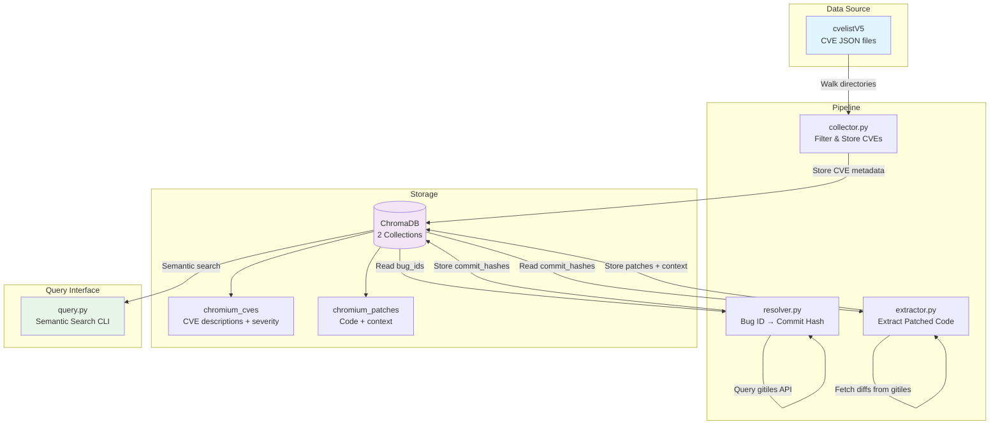
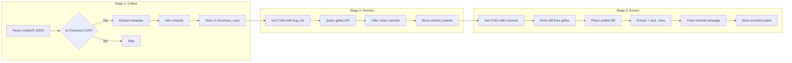
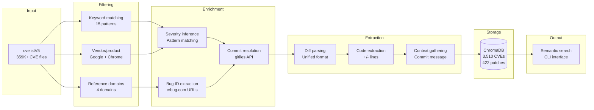

# Chromium CVE Patch Pattern Database

## Overview

A pipeline that collects Chromium CVEs, resolves them to fix commits, extracts patched code patterns, and stores everything in ChromaDB for semantic search by LLM models during vulnerability research.

## Architecture



### Pipeline Flow



## Stages

### Stage 1: Collector (`collector.py`)

Walks `cvelistV5/cves/`, filters Chromium-related CVEs, and stores metadata in ChromaDB.

**Filtering logic:**
- Description keywords: `google chrome`, `chromium`, `chrome os`, `v8`, `blink`, `skia`, `angle`, `pdfium`, `mojo`, `dawn`, `webgpu`, `omnibox`, `fedcm`, `autofill`
- Reference domains: `chromium.org`, `googlechromereleases.blogspot.com`, `crbug.com`, `chromium.googlesource.com`
- Vendor/product: Google + Chrome/Chromium/V8

**Extracted metadata:**
- `date_published`, `state`, `vendors`, `products`, `references` (URLs)
- `bug_ids` — parsed from `crbug.com/NNN`, `issues.chromium.org/issues/NNN`
- `commit_hashes` — parsed from `chromium.googlesource.com/.../+/<hash>`

**Incremental:** Queries ChromaDB for existing CVE IDs before processing.

### Stage 2: Resolver (`resolver.py`)

Maps bug IDs to Chromium commit hashes via the gitiles API.

**API:** `https://chromium.googlesource.com/chromium/src/+log?q=bug:NNNNN&format=JSON`

For each CVE with `bug_ids` but no `commit_hashes`, queries gitiles and stores resolved commits.

**Rate limiting:** 0.5s delay between requests.

### Stage 3: Extractor (`extractor.py`)

Fetches commit diffs and extracts patched source code.

**API:** `https://chromium.googlesource.com/chromium/src/+diff/<hash>%5E%21/?format=TEXT` (base64-encoded unified diff)

**Extraction:**
- Parses unified diff into per-file chunks
- Filters to source files only (`.cc`, `.cpp`, `.c`, `.h`, `.js`, `.ts`, `.py`, `.java`, `.rs`, `.go`)
- Extracts added lines (`+` lines) as the patched code
- Stores each file's patch as a separate ChromaDB entry

**Parallelism:** ThreadPoolExecutor with 5 workers.

### Stage 4: Query (`query.py`)

CLI tool for semantic search.

```bash
python query.py cves "sandbox escape" -n 5
python query.py patches "use after free in net/" --lang cpp -n 3
python query.py show CVE-2022-3075
```

## Data Flow



### Collection: `chromium_cves`

| Field | Type | Description |
|-------|------|-------------|
| `id` | string | CVE ID (e.g. `CVE-2022-3075`) |
| `document` | string | CVE description text (embedded) |
| `metadata.date_published` | string | ISO timestamp |
| `metadata.state` | string | e.g. `PUBLISHED` |
| `metadata.vendors` | list[string] | e.g. `["Google"]` |
| `metadata.products` | list[string] | e.g. `["Chrome"]` |
| `metadata.references` | list[string] | All reference URLs |
| `metadata.bug_ids` | list[string] | Chromium bug tracker IDs |
| `metadata.commit_hashes` | list[string] | Resolved fix commit hashes |
| `metadata.problem_types` | list[string] | e.g. `["Heap buffer overflow", "Use after free"]` |
| `metadata.severity` | string | `CRITICAL`, `HIGH`, `MEDIUM`, or `LOW` (inferred from description) |

### Collection: `chromium_patches`

| Field | Type | Description |
|-------|------|-------------|
| `id` | string | `{cve_id}::{hash}::{file_path}` |
| `document` | string | CVE info + commit message + code (embedded) |
| `metadata.cve_id` | string | Parent CVE |
| `metadata.commit_hash` | string | Fix commit |
| `metadata.file_path` | string | Source file path |
| `metadata.language` | string | File extension (cpp, js, etc.) |
| `metadata.severity` | string | `CRITICAL`, `HIGH`, `MEDIUM`, or `LOW` |
| `metadata.problem_types` | list[string] | Vulnerability types |
| `metadata.cve_description` | string | Full CVE description |
| `metadata.commit_message` | string | Git commit message explaining the fix |
| `metadata.vulnerable_code` | string | Removed lines (`-` in diff) — the vulnerable code |
| `metadata.patched_code` | string | Added lines (`+` in diff) — the fixed code |

## Configuration

`.env`:
```
cvelistV5_path="./cvelistV5"
CHROMA_HOST="localhost"
CHROMA_PORT="8001"
CHROMA_CVES_COLLECTION="chromium_cves"
CHROMA_PATCHES_COLLECTION="chromium_patches"
```

## Usage

```bash
# Start ChromaDB
docker compose up -d

# Run pipeline (each stage is incremental)
python collector.py    # ~5900 CVEs from cvelistV5
python resolver.py     # resolve bug IDs → commits (slow, API rate limited)
python extractor.py    # extract patched code from commits

# Query
python query.py cves "buffer overflow in renderer"
python query.py patches "use after free" --lang cpp
python query.py show CVE-2022-3075
```

## Files

| File | Purpose |
|------|---------|
| `collector.py` | Stage 1: CVE collection |
| `resolver.py` | Stage 2: Bug → commit resolution |
| `extractor.py` | Stage 3: Patch extraction |
| `query.py` | Stage 4: Semantic search CLI |
| `db.py` | Shared ChromaDB interface |
| `config.py` | Environment configuration |
| `docker-compose.yml` | ChromaDB container |
| `.env` | Local environment variables |
| `cvelistV5/` | CVE data (git submodule) |
